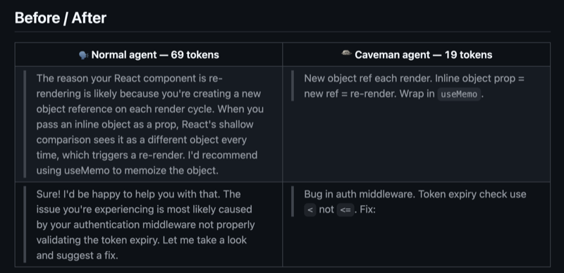
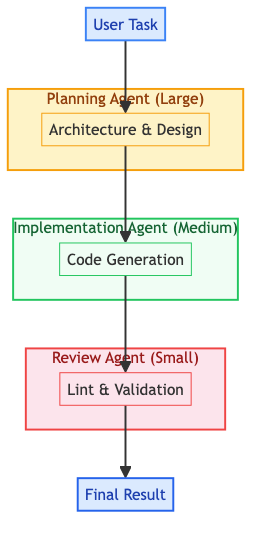
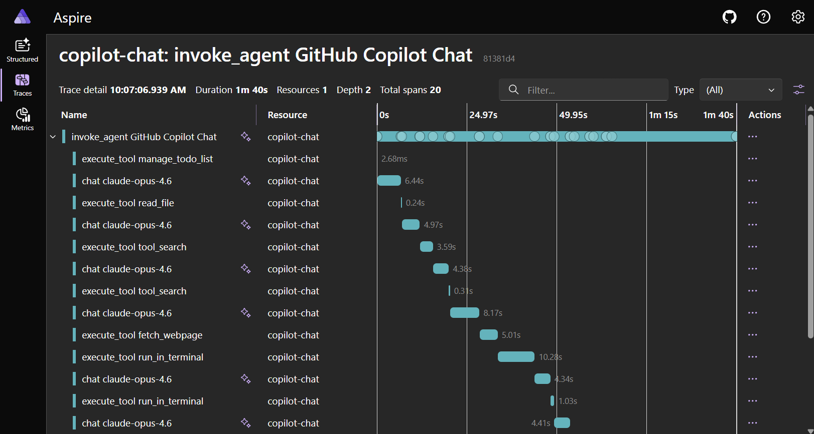
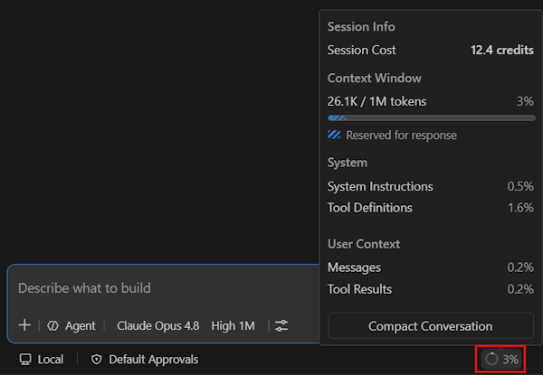

<!--markpress-opt
{
  "autoSplit": false,
  "sanitize": false,
  "title": "Understand and Optimize Coding Agent Token Cost"
}
markpress-opt-->

<!--slide-attr x=0 y=0 scale=1.2 -->

# Understand and Optimize Coding Agent Token Cost
## A practical guide to cost-efficient AI development

Duc Nguyen

<!-- SPEAKER NOTES
Welcome. Today I will walk through how token costs work in AI coding tools
and practical, measurable ways to reduce them. Based on real usage patterns.
-->

------

<!--slide-attr x=1600 y=0 scale=1.0 -->

# The Token Cost Formula

> Cost = Token In x Input Rate + Token Out x Output Rate

- **Token In**: prompt, attached files, tool outputs, conversation history
- **Token Out**: responses, generated code, tool call arguments
- **Input Rate**: $/token for input
- **Output Rate**: $/token for output

<!-- SPEAKER NOTES
The formula has two rate components. Input is cheaper; output is the
dominant cost factor. Thinking tokens are billed at the output rate.
-->

------

<!--slide-attr x=3200 y=0 scale=1.0 -->

# Control Token Volume

> Reduce what enters and exits the context window

- Attach only relevant files, not the entire project
- Start **fresh sessions** for separate tasks
- Request concise output, avoid verbose explanations
- Keep tool output out of context, use sandboxed execution

<!-- SPEAKER NOTES
Context is a budget. Every file attachment, tool output, and conversation
turn costs tokens. Being intentional about context is the highest-leverage
optimization you can make.
-->

------

<!--slide-attr x=0 y=1200 scale=1.0 -->

# Where Tokens Enter Context

| Token In | Token Out |
|---|---|
| Custom Instructions and Skills (AGENTS.md, ...) | Chat Response |
| User query and Images | - |
| Attached files | Generated code |
| Tool call outputs | Tool call arguments |
| Thinking token in | Thinking token out |
| Conversation history | - |

<!-- SPEAKER NOTES
Tool outputs and conversation history are the biggest contributors to
Token In. Each turn adds previous output to the next input. Token Out is
harder to control but smaller in volume -- focus reduction efforts on
Token In first.
-->

------

<!--slide-attr x=1600 y=1200 scale=1.0 -->

# Control Model Price

<table>
<thead>
<tr><th>Small</th><th>Medium</th><th>Large</th></tr>
</thead>
<tbody>
<tr>
<td></td>
<td></td>
<td></td>
</tr>
<tr>
<td></td>
<td></td>
<td></td>
</tr>
</tbody>
</table>

Model pricing comparison across tiers

<!-- SPEAKER NOTES
Two dominant factors: model tier selection and the input/output rate gap.
A verbose response from a large model is the worst case. Most optimization
effort should target these two.
-->

------

<!--slide-attr x=3200 y=1200 scale=1.0 -->

# Selective Model by Task

> Match the model to the task complexity

| Task | Recommended Model |
|---|---|
| Rename, format, boilerplate | Small |
| Feature implementation, refactoring | Mid |
| Architecture, debugging, design | Large |

<!-- SPEAKER NOTES
Not every code change needs Sonnet. Renaming a variable or adding a type
annotation is perfectly handled by Haiku at a fraction of the cost.
Auto-routing makes this transparent to the developer.
-->

------

<!--slide-attr x=1600 y=2400 scale=1.0 -->

# Understand Prompt Caching

> Server caches the common prefix of your prompt across requests

Prefix-based cache matching between requests

<!-- SPEAKER NOTES
The cache operates on prefix matching. Everything before the breakpoint
must be byte-identical. The diagram shows two requests where the system
prompt and AGENTS.md are identical -- they cache hit. The user query
is different, so it is not cached. Keeping your instructions stable
across a session is critical for maximum cache hits.
-->

------

<!--slide-attr x=2400 y=2400 scale=1.0 -->

# VSCode Built-in Cache Explorer

Built-in cache statistics panel in VS Code

<!-- SPEAKER NOTES
This is the actual cache explorer panel in VS Code. It shows you
real-time statistics on cache hits and misses -- which parts of your
prompt are being cached, how much you are saving, and what causes
cache misses. Use it to validate that your caching strategy is working
and to identify where cache is being invalidated unexpectedly.
-->

------

<!--slide-attr x=3200 y=2400 scale=1.0 -->

# Cache Pricing

| Model | Cache Miss (In/Out) | Cache (In/Out) |
|---|---|---|
| GPT-5.4 mini | 75 / 450 | 7 / 0 |
| MAI Code 1 Flash | 75 / 450 | 7 / 0 |
| GPT-5.4 | 250 / 1500 | 25 / 0 |
| Claude Sonnet 4.6 | 300 / 1500 | 30 / 375 |
| GPT-5.5 | 500 / 3000 | 50 / 0 |
| Claude Opus 4.6 | 500 / 2500 | 50 / 625 |

<!-- SPEAKER NOTES
Prices shown are per million tokens from GitHub Copilot's official
pricing page (docs.github.com/copilot/reference/.../models-and-pricing).
1 AI Credit = $0.01 USD. Output from Cache = 80% off.
Some models (e.g. OpenAI) have free cache write; Anthropic models
charge a cache write fee (~25% above input). Source: GitHub Copilot Models and Pricing.
-->

------

<!--slide-attr x=6400 y=2400 scale=1.0 -->

# Token Cost Optimization

| | Token Based | Model Based |
|---|---|---|
| **Approach** | Fewer tokens in/out | Utilize model |
| **Methods** | AGENTS.md, Skills, sandbox | Model selection, caching |
| **Impact** | Fewer total tokens | Lower $/token |

<!-- SPEAKER NOTES
Two parallel strategies: reduce the volume of tokens flowing through the
context window, or reduce the unit price of those tokens. Most cost savings
come from a combination of both.
-->

------

<!--slide-attr x=6400 y=1200 scale=1.0 -->

# Use AGENTS.md

> Give the model a map, not a maze

- Project-level instructions reduce exploration
- Model reads conventions once instead of re-discovering each turn
- Define: architecture, file layout, coding style, build commands

<strong>Impact:</strong> Fewer tool calls, fewer wrong assumptions, fewer correction rounds

<!-- SPEAKER NOTES
Without AGENTS.md, the model explores your codebase by reading files,
running searches, making wrong guesses. A good AGENTS.md eliminates
that exploration cost by providing the answers upfront.
-->

------

<!--slide-attr x=6400 y=600 scale=1.0 -->

# AGENTS.md

<table style="border: 0; background: transparent; margin-top: 0.5rem;">
<tbody>
<tr>
<td style="border: 0; width: 50%; text-align: center; vertical-align: top; padding: 0.4rem 0.6rem;">

Maze and navigation map

</td>
<td style="border: 0; width: 50%; text-align: center; vertical-align: top; padding: 0.4rem 0.6rem;">

AGENTS.md example

</td>
</tr>
</tbody>
</table>

<!-- SPEAKER NOTES
The model without AGENTS.md explores blindly — reading files, running searches, guessing conventions. AGENTS.md gives it a map upfront, slashing exploration costs.
-->

------

<!--slide-attr x=6400 y=0 scale=1.0 -->

# Sandbox Execution

> Process data outside the context window

- Run analysis in a sandbox: only the summary enters context
- A 700KB log file becomes a 3KB conclusion
- Principle: **compute outside, surface only results**
- Tools: context-mode, RTK, structured I/O pipelines

<strong>Impact:</strong> Heavy data processing stays outside the context window, only the result enters

<!-- SPEAKER NOTES
The core pattern: instead of reading a large file into context and then
analyzing it, run the analysis in a sandbox and print only the answer.
Think-in-Code, not Think-in-Context. This single pattern eliminates
the largest source of token waste.
-->

------

<!--slide-attr x=6400 y=-600 scale=1.0 -->

# Sandbox Environment

<table style="border: 0; background: transparent; margin-top: 0.2rem;">
<tbody>
<tr>
<td style="border: 0; width: 50%; text-align: center; vertical-align: middle; padding: 0.2rem 0.4rem;">

Sandbox execution mechanism

</td>
<td style="border: 0; width: 50%; text-align: center; vertical-align: middle; padding: 0.2rem 0.4rem;">

Context-mode: auto-indexing and search

RTK: deduplicate and truncate

</td>
</tr>
</tbody>
</table>

<!-- SPEAKER NOTES
This diagram shows the core sandbox pattern. Large data stays outside the
context window. The sandbox processes logs, tool outputs, and source files,
then only the 3KB summary enters the LLM context. This single pattern eliminates
the largest source of token waste.
-->

------

<!--slide-attr x=6400 y=-1200 scale=1.0 -->

# Output Constraints

> Shape how the model responds

- **Caveman skill**: enforce terse, minimal responses
- **Structured output**: JSON schemas, predictable format
- **Token caps**: limit response length explicitly
- Less verbosity = fewer output tokens

<strong>Impact:</strong> Output stays concise without losing substance on every interaction

<!-- SPEAKER NOTES
Models default to helpful, thorough explanations. A skill that says
"respond in under 50 characters" or "output valid JSON only" cuts
output tokens significantly. Especially useful for automated pipelines.
-->

------

<!--slide-attr x=6400 y=-1800 scale=1.0 -->

# Caveman Skill

Caveman skill forces minimal, terse responses - only the answer, no fluff

<!-- SPEAKER NOTES
The caveman skill forces the model to respond in terse, minimal fashion.
Instead of lengthy explanations, it gives just the answer. This dramatically
reduces output token count per interaction.
-->

------

<!--slide-attr x=6400 y=-2400 scale=1.0 -->

# Custom Agents

> Dedicated models for dedicated tasks

- **Planning**: architecture, design -> large model
- **Implementation**: code generation -> medium model
- **Review**: linting, validation -> small model
- Each agent has its own system prompt and model selection

<strong>Impact:</strong> Match model capability to task complexity, pay only for what you actually need

<!-- SPEAKER NOTES
Do not pay Opus prices for tasks Haiku handles well. Split your workflow:
planning needs reasoning, implementation needs code generation, review
only needs pattern matching. Different capabilities, different models.
-->

------

<!--slide-attr x=5600 y=-2400 scale=1.0 -->

# Agents Workflow

Agent pipeline: plan, implement, review

<!-- SPEAKER NOTES
Each task goes through a pipeline of specialized agents. The planning agent
designs the architecture using a large reasoning model. The implementation
agent writes the code with a medium model. The review agent validates with
a small model. Each agent uses only the capability needed.
-->

------

<!--slide-attr x=4800 y=-2400 scale=1.0 -->

# Utilize Prompt Caching

> Keep the cache warm

- **Same model throughout**: switching models invalidates cache
- **Separate sessions per task**: different instructions break the prefix
- **Stable prefix**: put instructions early, keep them unchanged
- **One session, one task**: avoid context drift

<strong>Impact:</strong> Cache reuses the common prefix across requests, reducing repeated token costs in long sessions

<!-- SPEAKER NOTES
The cache is fragile. If you switch from Sonnet to Haiku mid-task, it resets.
If you reuse a session for a different task with different instructions, it
resets. Design your workflow around these constraints to maximize cache hits.
-->

------

<!--slide-attr x=4000 y=-2400 scale=1.0 -->

# Common Cache Missed Pattern

Switch model mid-session

<!-- SPEAKER NOTES
Changing the model mid-session invalidates the cache. The model identifier is part of the cache prefix — switching between models from any provider causes a cache miss.
-->

------

<!--slide-attr x=3200 y=-2400 scale=1.0 -->

# Common Cache Missed Pattern

Change agent mode

<!-- SPEAKER NOTES
Switching between agent modes (e.g. from Ask to Agent) changes the system prompt prefix. The new mode prepends different instructions which breaks the byte-level cache match.
-->

------

<!--slide-attr x=2400 y=-2400 scale=1.0 -->

# Common Cache Missed Pattern

Different tool context

<!-- SPEAKER NOTES
Different tools and their outputs are injected into the prompt prefix. When tools change between turns, the prefix changes, and the cache misses.
-->

------

<!--slide-attr x=1600 y=-2400 scale=1.0 -->

# Common Cache Missed Pattern

Wait > TTL between turns

<!-- SPEAKER NOTES
Cache TTL varies by provider — 5 minutes default, up to 1 hour with paid options. If you walk away mid-session and come back later, the cache has expired. Every cache hit resets the timer, so continuous use keeps it warm.
-->

------

<!--slide-attr x=800 y=-2400 scale=1.0 -->

# Monitoring

> You cannot improve what you do not measure

- **VS Code Agent Debug**: built-in per-session token view
- **OpenTelemetry**: enable in VS Code settings for export
- **External collectors**: aggregate across sessions and projects
- **Baseline first**: document costs before applying any optimization

<!-- SPEAKER NOTES
Establish a baseline of your current token usage. Run the same representative
workload before and after each optimization. Quantify the impact. Without
measurement, you are guessing.
-->

------

<!--slide-attr x=0 y=-2400 scale=1.0 -->

# Dashboard Tracing & Context Control

<table style="border: 0; background: transparent; margin-top: 0.2rem;">
<tbody>
<tr>
<td style="border: 0; width: 50%; text-align: center; vertical-align: middle; padding: 0.2rem 0.4rem;">

</td>
<td style="border: 0; width: 50%; text-align: center; vertical-align: middle; padding: 0.2rem 0.4rem;">

</td>
</tr>
</tbody>
</table>

OpenTelemetry tracing and context window controls

<!-- SPEAKER NOTES
Tracing and dashboards give you the visibility to know what is costing you
money. VS Code's built-in debug panel shows per-session token counts. Export
via OpenTelemetry to aggregate across all developers on your team.

Context window management is equally important. Long sessions accumulate
conversation history that pushes context size up. Prune old turns, start
fresh sessions for new tasks, and be selective about file attachments.
These two practices — measure and control — form the feedback loop for
sustained optimization.
-->

------

<!--slide-attr x=0 y=3600 scale=1.0 -->

# Key Takeaways

| Strategy | Action |
|---|---|
| **Reduce Token Volume** | AGENTS.md, fresh sessions, sandbox, concise output |
| **Reduce Token Rate** | Right model for the task, prompt caching, output constraints |
| **Monitor &amp; Iterate** | Measure before optimizing, track cache hit rates, use Agent Debug |

<!-- SPEAKER NOTES
Three pillars of token cost optimization. First: reduce what enters the
context window. Second: reduce the price per token by choosing the right
model and leveraging caching. Third: establish a baseline before optimizing
so you can measure the impact.
-->

------

<!--slide-attr x=0 y=4800 rotate=-3 scale=1.1 -->

# Thank You

If you have any questions, feel free to reach out on <a href="https://github.com/vanduc2514" target="_blank" rel="noopener noreferrer" style="color: var(--group-accent); text-decoration: underline;">GitHub</a> or scan the QR below.

| GitHub | Website |
|---|---|
|  |  |
|  |  |

<!-- SPEAKER NOTES
Thank you. The key takeaway: optimization is about intentionality -- know
where your tokens go, make conscious choices about model, context, and output.
-->
