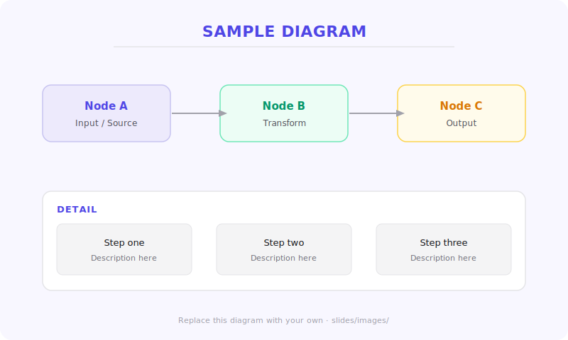

<!--markpress-opt
{
  "autoSplit": false,
  "sanitize": false,
  "title": "My Presentation"
}
markpress-opt-->

<!--slide-attr x=0 y=0 scale=1.2 -->

# Talk Title
## One-line description

Your Name · Event Name · Year

<!-- SPEAKER NOTES
Open with presence. Put the title up, pause, let it land.
Introduce yourself in one sentence.
-->

------

<!--slide-attr x=1700 y=-300 rotate=-2 scale=1.0 -->

# A Slide with a List

- First point with **emphasis**
- Second point with `inline code`
- Third point
- Fourth point — keep lists short

<!-- SPEAKER NOTES
Expand on each bullet. One idea per bullet.
Keep the slide text as a cue, not a transcript.
-->

------

<!--slide-attr x=2400 y=1600 rotate=3 scale=1.0 -->

# A Slide with Code

Use fenced code blocks for syntax highlighting:

```javascript
function greet(name) {
  return `Hello, ${name}`;
}

console.log(greet('world'));
```

<!-- SPEAKER NOTES
Walk through the code line by line.
Explain why this matters in context.
-->

------

<!--slide-attr x=3600 y=600 rotate=-3 scale=1.0 -->

# A Slide with a Quote

> "A well-written spec is a conversation with the future."

Blockquotes render with an accent-colored left border. Use them
for key quotes, callouts, or highlighted statements.

<!-- SPEAKER NOTES
Pause after reading the quote aloud.
Let it sink in before continuing.
-->

------

<!--slide-attr x=2200 y=3000 rotate=5 scale=1.0 -->

# A Slide with an Image



<!-- SPEAKER NOTES
Describe what the image shows.
Images are embedded as base64 in the output HTML by default.
Replace sample.svg with your own image.
-->

------

<!--slide-attr x=500 y=4200 rotate=-1 scale=1.1 -->

# Thank You

### Questions?

Your Name · [your@email.com](mailto:your@email.com) · [@yourhandle](https://example.com)

<!-- SPEAKER NOTES
Leave time for questions.
Have 2-3 backup examples ready.
-->
