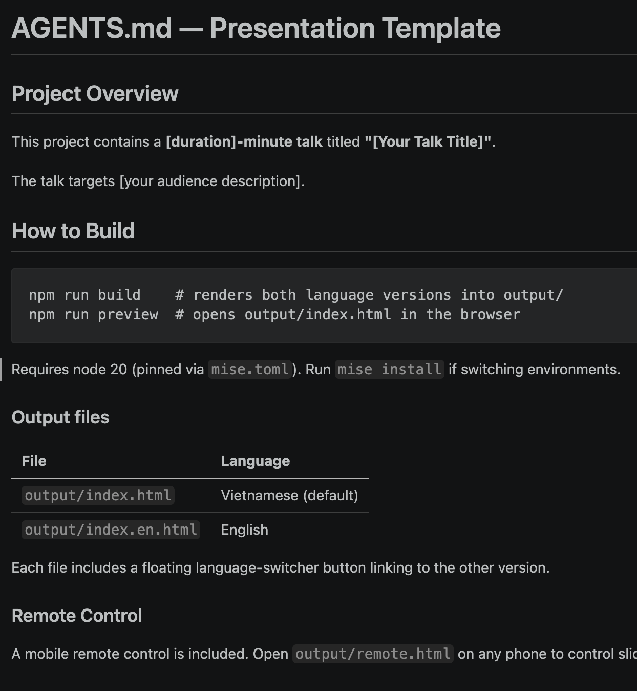
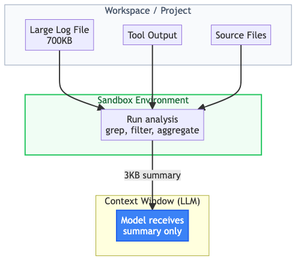
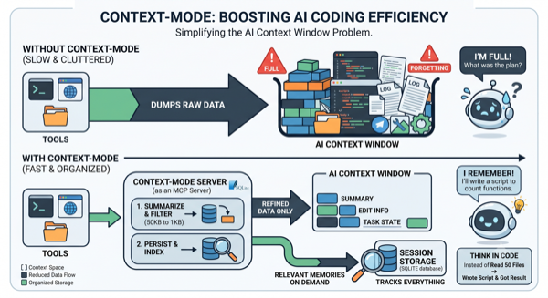
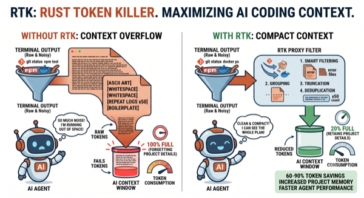

<!--markpress-opt
{
  "autoSplit": false,
  "sanitize": false,
  "title": "Tối ưu Chi phí Token trong Phát triển với AI"
}
markpress-opt-->

<!--slide-attr x=0 y=0 scale=1.2 -->

# Tối ưu Chi phí Token
## Chiến lược thực tế cho phát triển với AI

Duc Nguyen

<!-- SPEAKER NOTES
Chào mừng. Hôm nay tôi sẽ trình bày cách chi phí token hoạt động trong
các công cụ lập trình AI và các cách thực tế để giảm chi phí.
-->

------

<!--slide-attr x=1600 y=0 scale=1.0 -->

# Công thức Chi phí Token

> Chi phí = Token Vào x Giá Đầu vào + Token Ra x Giá Đầu ra

- **Token Vào**: prompt, file đính kèm, output công cụ, lịch sử hội thoại
- **Token Ra**: phản hồi, code sinh ra, tham số gọi công cụ
- **Giá Đầu vào**: $/token cho đầu vào
- **Giá Đầu ra**: $/token cho đầu ra

<!-- SPEAKER NOTES
Công thức có hai thành phần giá. Đầu vào rẻ hơn; đầu ra là yếu tố
chi phối. Token suy nghĩ được tính phí theo giá đầu ra.
-->

------

<!--slide-attr x=3200 y=0 scale=1.0 -->

# Kiểm Soát Lượng Token

> Giảm những gì đi vào và ra khỏi cửa sổ ngữ cảnh

- Chỉ đính kèm file liên quan, không phải toàn bộ dự án
- Bắt đầu **phiên mới** cho từng tác vụ riêng biệt
- Yêu cầu output ngắn gọn, tránh giải thích dài dòng
- Giữ output công cụ ngoài ngữ cảnh, dùng sandbox execution

<!-- SPEAKER NOTES
Ngữ cảnh là ngân sách. Mỗi file đính kèm, output công cụ, và lượt
hội thoại đều tiêu tốn token. Có chủ đích về ngữ cảnh là cách
tối ưu hiệu quả nhất.
-->

------

<!--slide-attr x=0 y=1200 scale=1.0 -->

# Token Đi Vào Ngữ Cảnh Từ Đâu

| Token Vào | Token Ra |
|---|---|
| Custom Instructions và Skills (AGENTS.md, ...) | Chat Response |
| Câu truy vấn và Hình ảnh | - |
| File đính kèm | Code được sinh ra |
| Output tool call | Tham số gọi công cụ |
| Thinking token vào | Thinking token ra |
| Lịch sử hội thoại | - |

<!-- SPEAKER NOTES
Output công cụ và lịch sử hội thoại là những yếu tố đóng góp lớn nhất
vào Token Vào. Mỗi lượt thêm output của lượt trước vào input của lượt sau.
Token Ra khó kiểm soát hơn nhưng ít hơn về khối lượng -- tập trung giảm
Token Vào trước.
-->

------

<!--slide-attr x=1600 y=1200 scale=1.0 -->

# Kiểm Soát Giá Mô Hình

<table>
<thead>
<tr><th>Nhỏ</th><th>Vừa</th><th>Lớn</th></tr>
</thead>
<tbody>
<tr>
<td></td>
<td></td>
<td></td>
</tr>
<tr>
<td></td>
<td></td>
<td></td>
</tr>
</tbody>
</table>

<!-- SPEAKER NOTES
Hai yếu tố chi phối: chọn cấp model và khoảng cách giá đầu vào/đầu ra.
Phản hồi dài dòng từ model lớn là trường hợp tệ nhất. Tập trung tối ưu
vào hai yếu tố này.
-->

------

<!--slide-attr x=3200 y=1200 scale=1.0 -->

# Chọn Model Theo Tác Vụ

> Khớp model với độ phức tạp của tác vụ

| Tác vụ | Model Đề xuất |
|---|---|
| Đổi tên, format, boilerplate | Nhỏ |
| Triển khai tính năng, refactoring | Vừa |
| Kiến trúc, debug, thiết kế | Lớn |

<!-- SPEAKER NOTES
Không phải thay đổi code nào cũng cần Sonnet. Đổi tên biến hay thêm
 type annotation được Haiku xử lý tốt với chi phí thấp hơn nhiều.
Auto-routing giúp việc này trong suốt với developer.
-->

------

<!--slide-attr x=1600 y=2400 scale=1.0 -->

# Hiểu về Prompt Caching

> Server cache tiền tố chung của prompt qua các request

<!-- SPEAKER NOTES
Cache hoạt động dựa trên khớp tiền tố. Mọi thứ trước breakpoint
phải giống hệt nhau từng byte. Sơ đồ cho thấy hai request với
system prompt và AGENTS.md giống nhau -- cache hit. Câu hỏi người
dùng khác nhau nên không được cache.
-->

------

<!--slide-attr x=2400 y=2400 scale=1.0 -->

# Cache Explorer có sẵn trong VSCode

<!-- SPEAKER NOTES
Đây là bảng Cache Explorer trong VS Code. Nó hiển thị thống kê
trực tiếp về cache hit và miss -- phần nào trong prompt đang được
cache, bạn tiết kiệm được bao nhiêu, và nguyên nhân gây miss.
Dùng nó để kiểm tra chiến lược cache và xác định chỗ cache bị
vô hiệu hóa bất ngờ.
-->

------

<!--slide-attr x=3200 y=2400 scale=1.0 -->

# Chi Phí Cache

| Model | Cache Miss (In/Out) | Cache (In/Out) |
|---|---|---|
| GPT-5.4 mini | 75 / 450 | 7 / 0 |
| MAI Code 1 Flash | 75 / 450 | 7 / 0 |
| GPT-5.4 | 250 / 1500 | 25 / 0 |
| Claude Sonnet 4.6 | 300 / 1500 | 30 / 375 |
| GPT-5.5 | 500 / 3000 | 50 / 0 |
| Claude Opus 4.6 | 500 / 2500 | 50 / 625 |

<!-- SPEAKER NOTES
Giá hiển thị là trên 1 triệu token từ trang pricing chính thức
của GitHub Copilot (docs.github.com/copilot/reference/...).
1 AI Credit = $0.01 USD. Output từ Cache giảm 80%.
Một số model (như OpenAI) miễn phí cache write; model Anthropic
tính phí cache write (~25% cao hơn input). Nguồn: GitHub Copilot Models and Pricing.
-->

------

<!--slide-attr x=6400 y=2400 scale=1.0 -->

# Tối ưu Chi phí Token

| | Dựa trên Token | Dựa trên Model |
|---|---|---|
| **Cách tiếp cận** | Ít token vào/ra hơn | Tận dụng model |
| **Phương pháp** | AGENTS.md, Skills, sandbox | Chọn model, caching |
| **Tác động** | Giảm tổng token | Giảm $/token |

<!-- SPEAKER NOTES
Hai chiến lược song song: giảm khối lượng token qua cửa sổ ngữ cảnh,
hoặc giảm đơn giá mỗi token. Hầu hết tiết kiệm chi phí đến từ sự kết hợp
cả hai.
-->

------

<!--slide-attr x=6400 y=1200 scale=1.0 -->

# Use AGENTS.md

> Cho model một bản đồ, không phải mê cung

- Hướng dẫn cấp dự án giảm khám phá
- Model đọc quy ước một lần thay vì khám phá lại mỗi lượt
- Định nghĩa: kiến trúc, cấu trúc file, phong cách code, lệnh build

<strong>Tác động:</strong> Ít tool call hơn, ít giả định sai hơn, ít vòng sửa lỗi hơn

<!-- SPEAKER NOTES
Không có AGENTS.md, model khám phá codebase bằng cách đọc file,
chạy tìm kiếm, đoán sai. AGENTS.md tốt loại bỏ chi phí khám phá
đó bằng cách cung cấp câu trả lời trước.
-->

------

<!--slide-attr x=6400 y=600 scale=1.0 -->

# AGENTS.md

<table style="border: 0; background: transparent; margin-top: 0.5rem;">
<tbody>
<tr>
<td style="border: 0; width: 50%; text-align: center; vertical-align: top; padding: 0.4rem 0.6rem;">

Mê cung và bản đồ dẫn đường

</td>
<td style="border: 0; width: 50%; text-align: center; vertical-align: top; padding: 0.4rem 0.6rem;">

Ví dụ AGENTS.md

</td>
</tr>
</tbody>
</table>

<!-- SPEAKER NOTES
Model không có AGENTS.md khám phá mù quáng — đọc file, chạy tìm kiếm, đoán quy ước. AGENTS.md cung cấp bản đồ từ đầu, cắt giảm chi phí khám phá.
-->

------

<!--slide-attr x=6400 y=0 scale=1.0 -->

# Sandbox Execution

> Xử lý dữ liệu bên ngoài cửa sổ ngữ cảnh

- Chạy phân tích trong sandbox: chỉ bản tóm tắt vào ngữ cảnh
- File log 700KB trở thành kết luận 3KB
- Nguyên tắc: **tính toán bên ngoài, chỉ hiển thị kết quả**
- Công cụ: context-mode, RTK, structured I/O pipelines

<strong>Tác động:</strong> Xử lý dữ liệu nặng ở bên ngoài, chỉ kết quả mới vào ngữ cảnh

<!-- SPEAKER NOTES
Mẫu cốt lõi: thay vì đọc file lớn vào ngữ cảnh rồi phân tích,
chạy phân tích trong sandbox và chỉ in ra câu trả lời.
Think-in-Code, không Think-in-Context. Mẫu này loại bỏ
nguồn lãng phí token lớn nhất.
-->

------

<!--slide-attr x=6400 y=-600 scale=1.0 -->

# Môi trường Sandbox

<table style="border: 0; background: transparent; margin-top: 0.2rem;">
<tbody>
<tr>
<td style="border: 0; width: 50%; text-align: center; vertical-align: middle; padding: 0.2rem 0.4rem;">

Cơ chế thực thi sandbox

</td>
<td style="border: 0; width: 50%; text-align: center; vertical-align: middle; padding: 0.2rem 0.4rem;">

Context-mode: tự động đánh chỉ mục và tìm kiếm

RTK: truy xuất kiến thức thời gian thực

</td>
</tr>
</tbody>
</table>

<!-- SPEAKER NOTES
Sơ đồ này cho thấy mẫu sandbox cốt lõi. Dữ liệu lớn ở bên ngoài cửa sổ
ngữ cảnh. Sandbox xử lý log, output công cụ, và source files, sau đó chỉ
tóm tắt 3KB vào ngữ cảnh LLM. Mẫu này loại bỏ nguồn lãng phí token lớn nhất.
-->

------

<!--slide-attr x=6400 y=-1200 scale=1.0 -->

# Ràng Buộc Output

> Định hình cách model phản hồi

- **Caveman skill**: áp đặt phản hồi ngắn gọn, tối thiểu
- **Structured output**: JSON schemas, định dạng dự đoán được
- **Token caps**: giới hạn độ dài phản hồi rõ ràng
- Ít dài dòng = ít token đầu ra

<strong>Tác động:</strong> Đầu ra luôn ngắn gọn mà không mất thông tin ở mọi tương tác

<!-- SPEAKER NOTES
Model mặc định có xu hướng giải thích chi tiết, hữu ích. Một skill
nói "trả lời dưới 50 ký tự" hoặc "chỉ output JSON" cắt giảm đáng kể
token đầu ra. Đặc biệt hữu ích cho pipeline tự động.
-->

------

<!--slide-attr x=6400 y=-2400 scale=1.0 -->

# Custom Agents

> Model riêng cho từng nhiệm vụ riêng

- **Lập kế hoạch**: kiến trúc, thiết kế -> model lớn
- **Triển khai**: sinh code -> model vừa
- **Kiểm tra**: linting, validation -> model nhỏ
- Mỗi agent có system prompt và lựa chọn model riêng

<strong>Tác động:</strong> Khớp năng lực model với độ phức tạp tác vụ, chỉ trả cho nhu cầu thực tế

<!-- SPEAKER NOTES
Đừng trả giá Opus cho việc Haiku làm tốt. Tách workflow:
lập kế hoạch cần lập luận, triển khai cần sinh code,
kiểm tra chỉ cần pattern matching. Khả năng khác nhau, model khác nhau.
-->

------

<!--slide-attr x=4800 y=-2400 scale=1.0 -->

# Tận Dụng Prompt Caching

> Giữ cache luôn nóng

- **Cùng model xuyên suốt**: đổi model hủy cache
- **Phiên riêng cho từng tác vụ**: hướng dẫn khác nhau phá vỡ tiền tố
- **Tiền tố ổn định**: đặt hướng dẫn sớm, giữ không đổi
- **Một phiên, một tác vụ**: tránh trôi ngữ cảnh

<strong>Tác động:</strong> Cache tái sử dụng tiền tố chung giữa các request, giảm chi phí token lặp lại trong phiên dài

<!-- SPEAKER NOTES
Cache rất dễ vỡ. Nếu bạn đổi từ Sonnet sang Haiku giữa tác vụ, cache
bị reset. Nếu dùng lại phiên cho tác vụ khác với hướng dẫn khác, cache
bị reset. Thiết kế workflow quanh những ràng buộc này.
-->

------

<!--slide-attr x=4000 y=-2400 scale=1.0 -->

# Mẫu Cache Miss Thường Gặp

Đổi model giữa phiên

<!-- SPEAKER NOTES
Đổi model giữa phiên làm hỏng cache vì định danh model là một phần của tiền tố cache. Ngay cả đổi giữa các model từ cùng nhà cung cấp cũng gây cache miss.
-->

------

<!--slide-attr x=3200 y=-2400 scale=1.0 -->

# Mẫu Cache Miss Thường Gặp

Đổi chế độ agent

<!-- SPEAKER NOTES
Chuyển giữa các chế độ agent (ví dụ từ Ask sang Agent) thay đổi tiền tố system prompt. Chế độ mới thêm hướng dẫn khác, phá vỡ khớp cache ở cấp byte.
-->

------

<!--slide-attr x=2400 y=-2400 scale=1.0 -->

# Mẫu Cache Miss Thường Gặp

Ngữ cảnh công cụ khác

<!-- SPEAKER NOTES
Các công cụ khác nhau và output của chúng được chèn vào tiền tố prompt. Khi tools thay đổi giữa các lượt, tiền tố thay đổi, cache miss.
-->

------

<!--slide-attr x=1600 y=-2400 scale=1.0 -->

# Mẫu Cache Miss Thường Gặp

Chờ quá TTL giữa các turn

<!-- SPEAKER NOTES
TTL cache tùy theo nhà cung cấp — mặc định ~5 phút, lên đến 1 giờ với tùy chọn trả phí. Nếu rời giữa phiên và quay lại sau, cache đã hết hạn. Mỗi cache hit reset đồng hồ, vì vậy sử dụng liên tục luôn giữ cache ấm.
-->

------

<!--slide-attr x=800 y=-2400 scale=1.0 -->

# Giám Sát

> Không thể cải thiện điều không đo lường được

- **VS Code Agent Debug**: xem token usage tích hợp mỗi phiên
- **OpenTelemetry**: bật trong cài đặt VS Code để export
- **External collectors**: tổng hợp qua các phiên và dự án
- **Baseline trước**: ghi nhận chi phí trước khi áp dụng tối ưu

<!-- SPEAKER NOTES
Thiết lập baseline về mức sử dụng token hiện tại. Chạy cùng workload
đại diện trước và sau mỗi lần tối ưu. Định lượng tác động. Không có
đo lường, bạn chỉ đang đoán.
-->

------

<!--slide-attr x=0 y=4800 rotate=-3 scale=1.1 -->

# Xin Cảm Ơn

Câu hỏi?

| GitHub | Website |
|---|---|
|  |  |
|  |  |

<!-- SPEAKER NOTES
Cảm ơn. Điểm chính: tối ưu là về sự có chủ đích -- biết token của bạn
đi đâu, lựa chọn có ý thức về model, ngữ cảnh, và output.
-->
